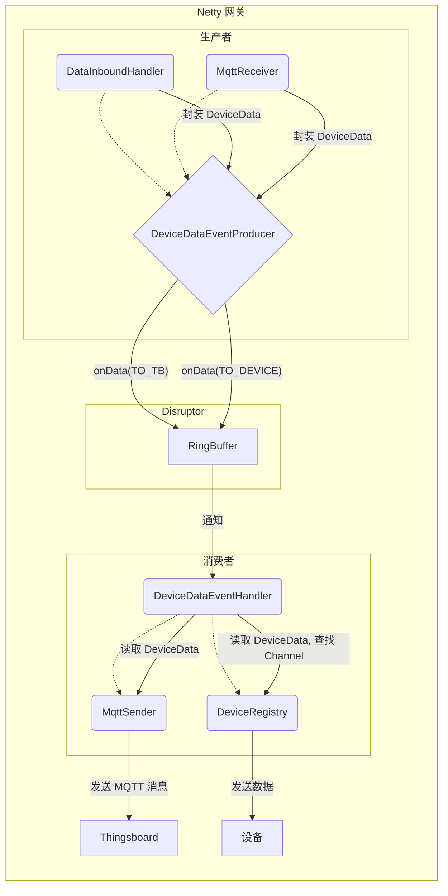

```mermaid
graph LR
    subgraph Gateway [Netty 网关]
        subgraph Producers [生产者]
            DIH(DataInboundHandler) -.-> DP{DeviceDataEventProducer}
            MR(MqttReceiver) -.-> DP
        end

        subgraph Disruptor
            RB[RingBuffer<DeviceDataEvent>]
        end

        subgraph Consumers [消费者]
            DEH(DeviceDataEventHandler) -.-> MS(MqttSender)
            DEH -.-> DR(DeviceRegistry)
        end
        
        DIH -- 封装 DeviceData --> DP
        DP -- onData(TO_TB) --> RB
        MR -- 封装 DeviceData --> DP
        DP -- onData(TO_DEVICE) --> RB
        RB -- 通知 --> DEH
        DEH -- 读取 DeviceData --> MS
        DEH -- 读取 DeviceData, 查找 Channel --> DR
        MS -- 发送 MQTT 消息 --> TB[Thingsboard]
        DR -- 发送数据 --> D[设备]
    end
```