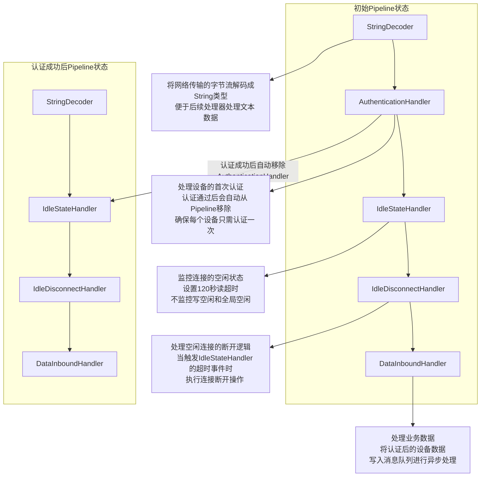

```mermaid
graph TD
    subgraph "初始Pipeline状态"
        A[StringDecoder] --> B[AuthenticationHandler]
        B --> C[IdleStateHandler]
        C --> D[IdleDisconnectHandler]
        D --> E[DataInboundHandler]
    end

    subgraph "认证成功后Pipeline状态"
        F[StringDecoder] --> H[IdleStateHandler]
        H --> I[IdleDisconnectHandler]
        I --> J[DataInboundHandler]
    end

    %% 添加状态转换说明
    B --"认证成功后自动移除AuthenticationHandler"--> H

    %% 为每个组件添加注释说明
    note1[将网络传输的字节流解码成String类型
    便于后续处理器处理文本数据]
    A --> note1

    note2[处理设备的首次认证
    认证通过后会自动从Pipeline移除
    确保每个设备只需认证一次]
    B --> note2

    note3[监控连接的空闲状态
    设置120秒读超时
    不监控写空闲和全局空闲]
    C --> note3

    note4[处理空闲连接的断开逻辑
    当触发IdleStateHandler的超时事件时
    执行连接断开操作]
    D --> note4

    note5[处理业务数据
    将认证后的设备数据
    写入消息队列进行异步处理]
    E --> note5

```