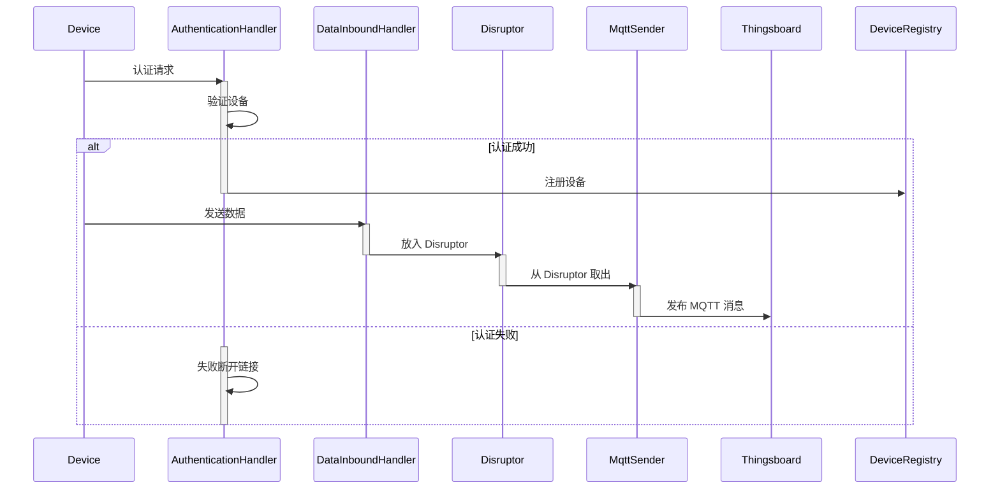
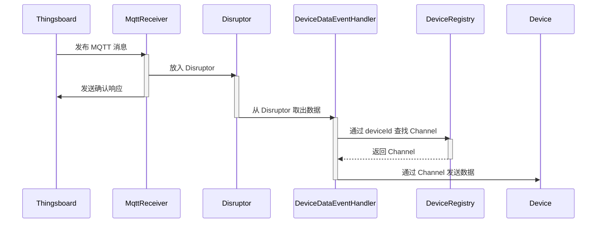

## Devices --> ThingsBoard

```mermaid
sequenceDiagram
    participant Device
    participant AuthenticationHandler
    participant DataInboundHandler
    participant Disruptor
    participant MqttSender
    participant Thingsboard

    Device->>AuthenticationHandler: 认证请求
    activate AuthenticationHandler
    AuthenticationHandler->>AuthenticationHandler: 验证设备
    
    alt 认证成功
        AuthenticationHandler->>DeviceRegistry: 注册设备
        %% AuthenticationHandler-->>Device: 认证响应
        deactivate AuthenticationHandler
    
        
        Device->>DataInboundHandler: 发送数据
        activate DataInboundHandler
        DataInboundHandler->>Disruptor: 放入 Disruptor
        deactivate DataInboundHandler
        
        activate Disruptor
        Disruptor->>MqttSender: 从 Disruptor 取出
        deactivate Disruptor
        
        activate MqttSender
        MqttSender->>Thingsboard: 发布 MQTT 消息
        deactivate MqttSender
    else 认证失败
        activate AuthenticationHandler
        AuthenticationHandler->>AuthenticationHandler: 失败断开链接
    end
    deactivate AuthenticationHandler
```

## ThingsBoard --> Devices

```mermaid
sequenceDiagram
    participant Thingsboard
    participant MqttReceiver
    participant Disruptor
    participant DeviceDataEventHandler
    participant DeviceRegistry
    participant Device

    Thingsboard->>MqttReceiver: 发布 MQTT 消息
    activate MqttReceiver
    MqttReceiver->>Disruptor: 放入 Disruptor
    activate Disruptor
    MqttReceiver->>Thingsboard: 发送确认响应
    deactivate MqttReceiver

    Disruptor->>DeviceDataEventHandler: 从 Disruptor 取出数据
    deactivate Disruptor
    activate DeviceDataEventHandler
    DeviceDataEventHandler->>DeviceRegistry: 通过 deviceId 查找 Channel
    activate DeviceRegistry
    DeviceRegistry-->>DeviceDataEventHandler: 返回 Channel
    deactivate DeviceRegistry
    DeviceDataEventHandler->>Device: 通过 Channel 发送数据
    deactivate DeviceDataEventHandler
```