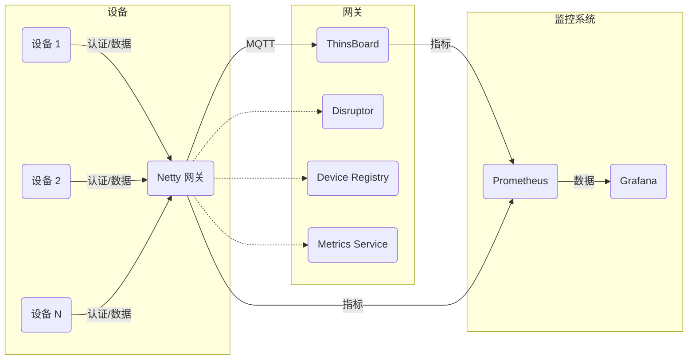

## 图表解释:

Devices: 代表各种连接到网关的设备。

Gateway: 代表 Netty 网关，负责处理设备连接、认证、数据转发和 MQTT 通信。

Thingsboard: 代表 Thingsboard 平台。

Disruptor (DM): 网关内部的 Disruptor 队列，用于异步处理数据。

Device Registry (DR): 设备注册表，用于管理设备和 Netty Channel 的映射关系。

Metrics Service (MS): 监控服务,收集各项指标。

Monitoring: 监控系统，包括 Prometheus（收集指标）和 Grafana（展示指标）。

